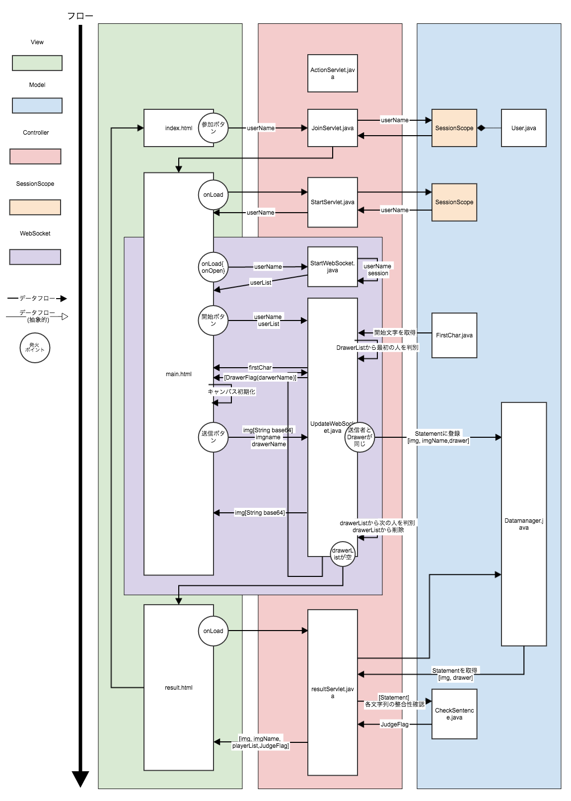

#SystemProjectII 絵しりとり-DrawWordChain-
情報システムプロジェクトIIのB-17班による絵しりとり用プログラム．

# 既知のバグ
- mian.htmlでプレイ中にDisconnectされた場合，ゲームが永久的に終わらない

# 未実装
- 時間制限によるユーザの交代
- プレイ中か参加可能かの判定をindex.htmlに表示

# 著作権表示
Released under the MIT license.
このプログラムはMITライセンスに基づく．
Check MITLICENSE.txt

このプログラムにはアパッチライセンス2.0に基づくJacksonを使用している．
This software includes the work that is distributed in the Apache License 2.0

# フローチャート

